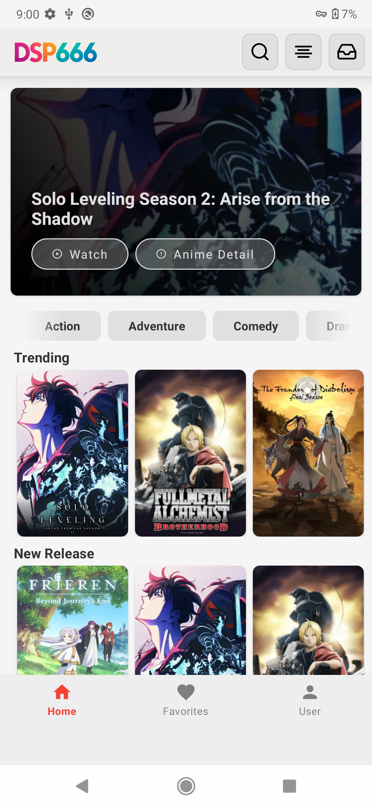
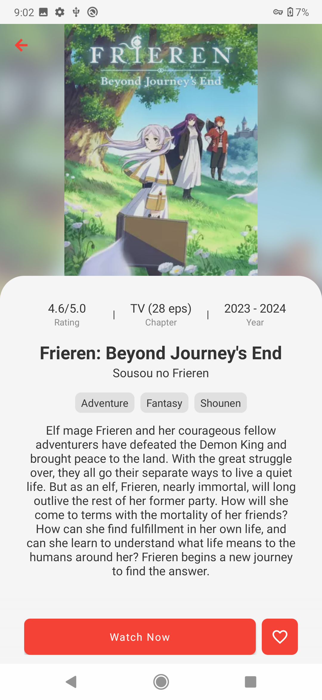
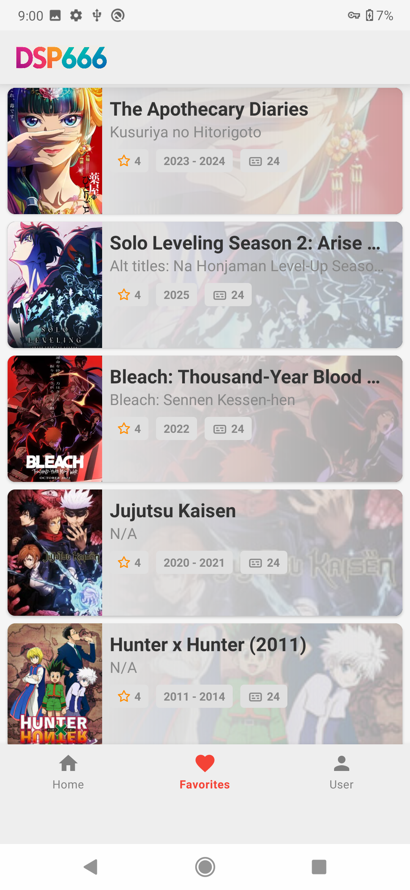

# 🎬 D-Stream

Welcome to **D-Stream** — a modern and minimalistic Android streaming application built with **Kotlin** and powered by the latest Android tech stack!


---

## 🚀 Features

✨ Beautiful and responsive UI  
📺 Smooth video playback with ExoPlayer  
🔌 Clean architecture with Hilt for DI  
🔄 Pagination support using Paging 3  
📡 API fetching with Retrofit and OkHttp  
💾 Local caching using Room  
🖼️ Image loading with Glide  
📂 JSON parsing with Gson  
📍 Navigation Component  
🌀 Circle Image Views and Flexbox layout

---

## 🔗 API

This application is powered by a custom-built backend API developed in Golang.

Check out the backend repository here:

➡️ [Golang-stream (REST API)](https://github.com/wildanasyrof/Golang-stream)

The API provides anime data, detail endpoints, search functionality, and favorites support.

---

## 🖼️ Screenshots

| Home Screen | Player Screen | Settings Screen |
|:-----------:|:-------------:|:---------------:|
|  |  |  |

---

## 🧩 Tech Stack

| Category | Library |
|---------|---------|
| **Language** | Kotlin |
| **Networking** | Retrofit, OkHttp |
| **Database** | Room (with Coroutine support) |
| **Architecture** | MVVM, ViewModel, LiveData |
| **Dependency Injection** | Hilt |
| **Media Playback** | ExoPlayer |
| **Image Loading** | Glide |
| **JSON Parsing** | Gson |
| **Async Tasks** | Kotlin Coroutines |
| **Pagination** | Paging 3 |
| **UI Enhancements** | Flexbox, CircleImageView |
| **Preferences** | DataStore |

---

## 🛠️ Installation

### 📥 Prerequisites
- Android Studio **Arctic Fox** or later
- Android SDK **21+**
- Gradle **7.0+**

### ⚙️ Steps
1. Clone this repository:
   ```bash
   git clone https://github.com/wildanasyrof/D-Stream.git
   ```

2. Open the project with Android Studio.

3. Let Gradle sync and download dependencies.

4. Run the app on a device or emulator.

---

## 🧑‍💻 Contributions
Open for contributions! Feel free to fork this repository and submit a pull request if you’d like to add features or improvements.

## 🙌 Acknowledgments

Thanks to all open-source libraries and tools used in this project 🙏  
Inspired by the love for anime and clean UI design 🎨
